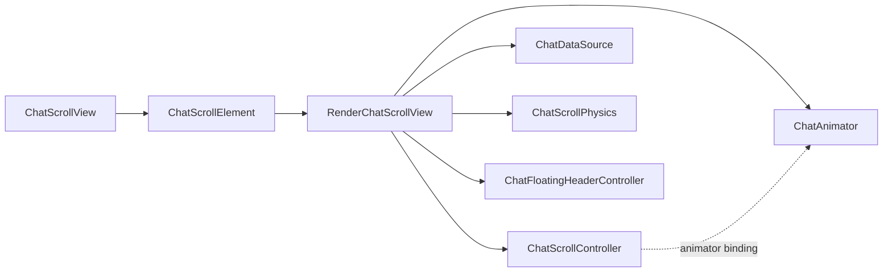

# Layers

The viewport is a custom `Widget` + `Element` + `RenderObject` stack, plus
headless types that own data and navigation state. Messages are real widgets
(each typically a `RepaintBoundary`), inflated lazily during layout — the same
idea as `SliverMultiBoxAdaptorElement`, without the sliver protocol.

## Layer table

| Layer | Type | Responsibility |
|-------|------|----------------|
| `ChatScrollView` | `RenderObjectWidget` | Public API: `dataSource`, `controller`, builders, pads, cache extents |
| `ChatScrollElement` | `RenderObjectElement` + `ChatChildManager` | Lazy inflate / deactivate children; skip-rebuild cache; slot routing |
| `RenderChatScrollView` | `RenderBox` | Layout, Tier-1 scroll, gestures, fetch schedule, paint, semantics |
| `ChatScrollController` | Headless | Anchor ownership, `jumpTo` / `scrollBy` / `animateTo`, events, `visibleRange`, `isAtTail` |
| `ChatDataSource` | Headless | Chunks, fetch, boundaries, absent slots, typed data listeners |
| `ChatFloatingHeaderController` | Headless geometry | Day scan, fade math, header bucket state (no widgets) |
| `ChatAnimator` | Headless | Close/far `animateTo`, post-settle highlight |
| `ChatScrollPhysics` | Headless | Fling simulation, overscroll resistance, bounceback |
| `ChatChunkFetchScheduler` | Headless (render-owned) | Fetch poll, jump-fetch, LRU eviction coordination |

## Ownership boundaries



- **Controller** owns the anchor pair and public navigation API. It does **not**
  own conversation boundaries (those live on `ChatDataSource`). The render
  object mirrors `oldestKnownId` / `newestKnownId` onto the controller for
  convenience.
- **Data source** owns message bytes and fetch. It does **not** know about
  pixels or anchors.
- **Render object** is the only place that combines both: it reads data,
  writes the anchor (via controller internals), and places children.
- **Element** never computes day boundaries or scroll geometry; it only builds
  widgets from parameters the render object supplies.
- **Floating header controller** is pure geometry/state; the render object
  still owns the header `RenderBox` and calls `buildFloatingHeader`.
- **Physics** never touches the controller’s event APIs; the render object
  emits `ChatFlingStart` / `ChatFlingEnd` when simulations start/stop.
- **Animator** is bound on attach (`controller.animator = …`) and cleared on
  detach / dispose.

## Public vs internal mutation

| API | Who may call | Effect |
|-----|--------------|--------|
| `jumpTo`, `scrollBy`, `animateTo` | App / demo | Notifying navigation |
| `applyScrollDelta`, `reassignAnchor` | Render / animator only (`@internal`) | Silent anchor mutation |
| `visibleRange=`, `isAtTail=` | Render only | Deferred listenable push |
| `notifyScrollEvent` | Render only | Typed scroll event stream |
| `ChatChildManager.*` | Render only, inside layout callback | Child lifecycle |

## Two performance tiers

| Tier | Entry | Rebuild widgets? | Relayout children? | Typical trigger |
|------|-------|------------------|--------------------|-----------------|
| **1** | `_onTick` | No | No (offsets only) | Drag, fling, bounceback, close-path animate |
| **2** | `performLayout` | Yes (lazy inflate) | Yes | Jump, data change, range uncovered, day-header text change |

Tier-1 relies on each message being a `RepaintBoundary` (or `DatedMessage`’s
inner boundaries) so the framework moves cached layers when parent-data
offsets change.

## File map

```
lib/src/
  chat_scroll/                    # headless core
    chat_scroll_controller.dart
    chat_data_source.dart
    chat_scroll_chunk.dart
    chat_scroll_common.dart
    chat_scroll_physics.dart
    chat_animator.dart
    chat_floating_header_controller.dart
    chat_chunk_fetch_scheduler.dart
    chat_range_fetch.dart
    chat_scroll_events.dart
    chat_selection_controller.dart
  chat_widgets/                   # widget implementation
    chat_scroll_view.dart
    chat_scroll_element.dart
    render_chat_scroll_view.dart
    chat_dated_message.dart
    chat_scrollbar.dart
    chat_selectable_message.dart
    chat_data_source_ext.dart
example/lib/                      # demo app only
```

## Overlay mode

When the conversation is confirmed empty or still initial-loading (and the
matching builder is wired), the render object enters **overlay mode**: message
fan-out is dropped, a single full-viewport child is built, and scroll/fling/
animate are aborted. Empty wins over loading if both flags are true.

See [04-layout-pipeline.md](04-layout-pipeline.md) for the mode-selection
branch at the start of `performLayout`.
