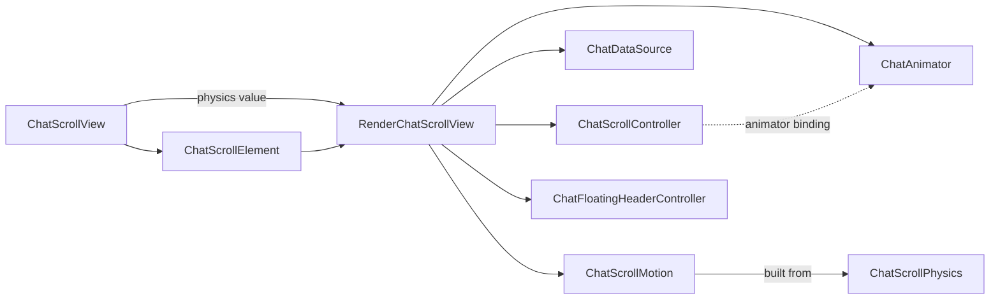

# Layers

The viewport is a custom `Widget` + `Element` + `RenderObject` stack, plus
headless types that own data and navigation state. Messages are real widgets
(each typically a `RepaintBoundary`), inflated lazily during layout — the same
idea as `SliverMultiBoxAdaptorElement`, without the sliver protocol.

## Layer table

| Layer | Type | Responsibility |
|-------|------|----------------|
| `ChatScrollView` | `RenderObjectWidget` | Public API: `dataSource`, `controller`, builders, pads, cache extents, `physics` |
| `ChatScrollElement` | `RenderObjectElement` + `ChatChildManager` | Lazy inflate / deactivate children; skip-rebuild cache; slot routing |
| `RenderChatScrollView` | `RenderBox` | Layout, Tier-1 scroll, gestures, fetch schedule, paint, semantics |
| `ChatScrollController` | Headless | Anchor ownership, `jumpTo` / `jumpToCenterBand` / `scrollBy` / `animateTo` / `highlight`, events, `visibleRange`, `centerBand`, `isAtTail` |
| `ChatDataSource` | Headless | Chunks, fetch, boundaries, absent slots, typed data listeners |
| `ChatFloatingHeaderController` | Headless geometry | Day scan, fade math, header bucket state (no widgets) |
| `ChatAnimator` | Headless | Close/far `animateTo`, Message highlight wash |
| `ChatScrollPhysics` | Immutable value (public) | Host choice of fling + edge effect (closed sets with tunable params); `.stretch()` / `.rubberBand()` / `.clamped()` presets, `.forPlatform()` default |
| `ChatScrollMotion` | Headless (render-owned, `@internal`) | Per-viewport runtime for one physics value: `ChatFlingMotion` + `ChatEdgeEffectState` |
| `ChatFlingMotion` | Headless (`@internal`) | Fling simulation lifecycle (spline or decay); offset deltas per tick |
| `ChatStretchOverscroll` | Headless (`@internal`) | Stretch edge effect: pull, release rules, return spring, paint matrix |
| `ChatRubberBandOverscroll` | Headless (`@internal`) | Rubber-band edge effect: resistance curve, reverse claim, impact overshoot, spring, translate matrix |
| `ChatNoOverscroll` | Headless (`@internal`, const) | None edge effect: drops motion past a pin, never paints |
| `ChatChunkFetchScheduler` | Headless (render-owned) | Fetch poll, jump-fetch, LRU eviction coordination |

## Ownership boundaries


```mermaid
flowchart LR
  Widget[ChatScrollView]
  Element[ChatScrollElement]
  Render[RenderChatScrollView]
  Ctrl[ChatScrollController]
  DS[ChatDataSource]
  Anim[ChatAnimator]
  Phys[ChatScrollPhysics]
  Motion[ChatScrollMotion]
  FH[ChatFloatingHeaderController]

  Widget --> Element
  Widget -->|physics value| Render
  Element --> Render
  Render --> Ctrl
  Render --> DS
  Render --> Anim
  Render --> Motion
  Motion -->|built from| Phys
  Render --> FH
  Ctrl -.->|animator binding| Anim
```

- **Controller** owns the anchor pair and public navigation API. It does **not**
  own conversation boundaries (those live on `ChatDataSource`). The render
  object mirrors `oldestKnownId` / `newestKnownId` onto the controller for
  convenience.
- **Data source** owns message bytes and fetch. It does **not** know about
  pixels or anchors.
- **Render object** is the only place that combines both: it reads data,
  writes the anchor (via controller internals), and places children.
- **Element** never computes day boundaries or scroll geometry; it only builds
  widgets from parameters the render object supplies.
- **Floating header controller** is pure geometry/state; the render object
  still owns the header `RenderBox` and calls `buildFloatingHeader`.
- **Physics** is a host-owned value; **motion** is its per-viewport runtime,
  rebuilt only when an unequal value arrives. Neither touches the
  controller’s event APIs; the render object emits `ChatFlingStart` /
  `ChatFlingEnd` when simulations start/stop. Edge-effect release rules live
  in the edge-effect strategy, not in the render tick.
- **Animator** is bound on attach (`controller.animator = …`) and cleared on
  detach / dispose.

## Public vs internal mutation

| API | Who may call | Effect |
|-----|--------------|--------|
| `jumpTo`, `jumpToCenterBand`, `scrollBy`, `animateTo` | App / demo | Notifying navigation |
| `highlight` | App / demo | Attention slot only — does not notify jump or scroll |
| `applyScrollDelta`, `reassignAnchor` | Render / animator only (`@internal`) | Silent anchor mutation |
| `visibleRange=`, `centerBand=`, `isAtTail=` | Render only | Deferred listenable push |
| `notifyScrollEvent` | Render only | Typed scroll event stream |
| `ChatChildManager.*` | Render only, inside layout callback | Child lifecycle |

## Two performance tiers

| Tier | Entry | Rebuild widgets? | Relayout children? | Typical trigger |
|------|-------|------------------|--------------------|-----------------|
| **1** | `_onTick` | No | No (offsets only) | Drag, fling, edge-effect spring, close-path animate |
| **2** | `performLayout` | Yes (lazy inflate) | Yes | Jump, data change, range uncovered, day-header text change |

Tier-1 relies on each message being a `RepaintBoundary` (or `ChatRowChrome`’s
per-child boundaries) so the framework moves cached layers when parent-data
offsets change.

## File map

```
lib/src/
  chat_scroll/                    # headless core
    chat_scroll_controller.dart
    chat_data_source.dart
    chat_scroll_chunk.dart
    chat_scroll_common.dart
    chat_scroll_physics.dart      # public physics value + ChatFlingMotion
    chat_scroll_motion.dart       # per-viewport runtime + edge-effect seam + none
    chat_stretch_overscroll.dart  # stretch edge effect
    chat_rubber_band_overscroll.dart  # rubber-band edge effect
    chat_animator.dart
    chat_floating_header_controller.dart
    chat_chunk_fetch_scheduler.dart
    chat_range_fetch.dart
    chat_scroll_events.dart
    chat_selection_controller.dart
  chat_widgets/                   # widget implementation
    chat_scroll_view.dart
    chat_scroll_element.dart
    render_chat_scroll_view.dart
    chat_row_chrome.dart
    chat_dated_message.dart       # deprecated forward to ChatRowChrome
    chat_scrollbar.dart
    chat_selectable_message.dart
    chat_selection_pointer.dart
    chat_data_source_ext.dart
example/lib/                      # demo app only
```

## Overlay mode

When the conversation is confirmed empty or still initial-loading (and the
matching builder is wired), the render object enters **overlay mode**: message
fan-out is dropped, a single full-viewport child is built, and scroll/fling/
animate are aborted. Empty wins over loading if both flags are true.

See [04-layout-pipeline.md](04-layout-pipeline.md) for the mode-selection
branch at the start of `performLayout`.
