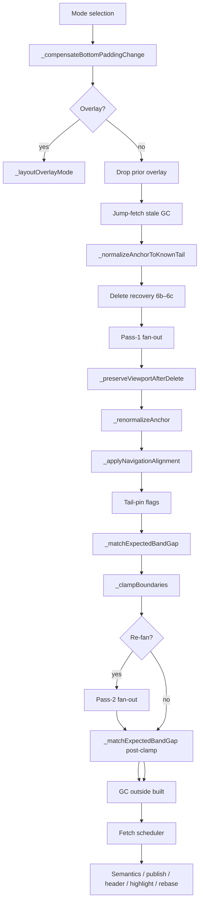

# Layout Pipeline

Source: `RenderChatScrollView.performLayout` in
`lib/src/chat_widgets/render_chat_scroll_view.dart` (approximately lines
1260–1533).

Preconditions: `childManager` wired by `ChatScrollElement.mount`; constraints
have bounded width and height (`sizedByParent` already applied size).

## Ordered steps



### 1. Mode selection

- If `dataSource.isEmpty` → empty overlay (or `none` if no `emptyBuilder`).
  Empty **always** skips message fan-out (no shimmer for phantom ids).
- Else if `hasLoadingBuilder && isInitialLoading` → loading overlay.
- Else → normal mode.

**Empty wins over loading** when both could be true (fetch resolves to `[]`
and seeds empty boundaries).

### 2. `_compensateBottomPaddingChange`

Always runs (including before overlay early exit). Shifts
`anchorPixelOffset` by `previousPad - currentPad` so on-screen content stays
fixed when the composer/keyboard inset changes. Seeds on first layout without
scrolling (initial inset must not jump). See [06-boundaries.md](06-boundaries.md).

### 3. Overlay early exit

If empty or overlay kind ≠ `none`, run `_layoutOverlayMode` and **return**.
That path GCs all messages, chunk-errors, and the floating header; builds the
overlay child; clears scroll velocity, pending delta, fling, animate,
bounceback, and drag.

### 4. Drop prior overlay

When returning to normal mode, `buildOverlay(ChatOverlayKind.none)` if an
overlay was active.

### 5. Jump-fetch stale GC

If `ChatChunkFetchScheduler.jumpFetchPending`, remove **all** message and
chunk-error children **before** the first fan-out. Otherwise renormalize/clamp
would walk stale maps from the previous anchor region.

### 6. `_normalizeAnchorToKnownTail`

Clamps a pre-mount `jumpTo` that landed past `newestKnownId` (listener gap
before attach). May `reassignAnchor` and mark tail pin.

### 6b. Absent anchor hygiene (before fan-out)

After step 6, before the first fan-out:

1. **`_recordLayoutBeforeDelete`** — when `statusOf(anchorId).isAbsent`, capture
   deleted height, anchor Y, visible band id/bottom/gap, tail flags into
   `_BeforeDeleteLayoutSnapshot`.
2. **`_reassignAnchorIfAbsent`** — move anchor to a present neighbor (tail:
   previous first, else next; non-tail: next first, else previous). Preserves
   `anchorPixelOffset` for the handoff.
3. **`_purgeAbsentBuiltChildren`** — `removeChildren` for any built id whose
   `statusOf` is absent (deactivates element + clears skip-cache).

Fan-out and `_buildMessage` also skip absent ids as defense in depth.

### 6c. Viewport preservation (after pass-1 fan-out)

When a before-delete snapshot was recorded:

1. **`_preserveViewportAfterDelete`** — computes `scrollDelta` via
   `_scrollDeltaForDelete`, applies `_shiftLayoutByScrollDelta` when needed,
   sets recovery flags, emits `layout.deleteCollapse`.
2. **Conditional refan** — when recovery is active but `_bottomBandMessage()`
   is null (mid-scroll off-screen), re-run pass-1 fan-out once.
3. **Skip renormalize** — `_skipRenormalizeDuringDeleteRecovery()` blocks
   `_renormalizeAnchor` for this pass (intentional off-screen anchor after
   delete is not scroll drift).
4. **`_matchExpectedBandGap`** — before and once after `_clampBoundaries`,
   nudge scroll so band gap matches pre-delete gap (≤ 8 logical px tolerance).
5. **Pin guards during recovery** — `pinNewest` blocked when user had
   preempted tail or was not at tail before delete; `pinOldest` skipped when a
   visible band exists. See [10-navigation-and-tail.md](10-navigation-and-tail.md)
   and [06-boundaries.md](06-boundaries.md).

Recovery flags clear at end of `performLayout`.

### 7. Pass-1 fan-out — `_layoutFromAnchor` → `_fanOutFromAnchor`

Inside `_invokeChildManagerLayout`. Builds and lays out children around the
current anchor. Details below.

### 8. `_renormalizeAnchor` (unless close-path or delete-recovery skip)

If the anchor box is outside `[-cacheExtent, height + cacheExtent]`, rebase to
the topmost visible child. **Skipped** when
`_animator.isAnimating && !_animator.farAnimateActive` so close-path animate
keeps the target as anchor even when off-screen.

### 9. `_applyNavigationAlignment`

If `navigationAlignmentMessageId` matches the anchor and the row is built,
snap `anchorPixelOffset` to `_alignedTopForMessage`. **Skipped** during
close-path animate (dual-writer guard). **Cleared without snap** when the
target is the known newest (tail pin owns geometry). May call
`_repositionFromAnchor`.

### 10. Tail-pin flags → gap match → `_clampBoundaries`

```
tailAdvanced = _wasAtTailLastLayout && newest advanced since _lastSeenNewestId
_applyPendingTailPin()   // may set _pinTailOnJump again
repinBottom = _pinTailOnJump || (reachedNewest && wasAtTail && tailAdvanced)
_pinTailOnJump = false   // one-shot consumed
_clampBoundaries(repinBottom: repinBottom)
```

If clamp applied → `_cancelFling()`. When delete recovery is active,
`_matchExpectedBandGap(maxPasses: 1)` runs once more after refan.

### 11. Pass-2 re-fan

Re-run fan-out if `clamped || anchorId changed || alignmentMoved`. Pass-1 may
have built a long chain from an off-screen anchor; pass-2 from the corrected
anchor yields the tight set so extras fall outside `built` and are GC’d.

### 12. GC

Remove message ids not in `built` and chunk-error indices not in `builtChunks`,
except ids in `_gcPinnedDuringClosePath()` (`animateTargetId` and
`navigationAlignmentMessageId`) so close-path targets survive while off-screen.

### 13. Fetch scheduler

Compute `minChunk` / `maxChunk` from remaining children and chunk-errors;
`_chunkFetchScheduler.onLayoutComplete(minChunk, maxChunk)` (poll, eviction,
jump-fetch completion).

### 14. Publish and chrome

1. `_updateScrollSemantics`
2. `_publishControllerState` (boundaries, `visibleRange`, `isAtTail` snapshot)
3. `_updateFloatingHeader` (may rebuild header widget)
4. `_animator.tryArmPendingHighlight`
5. If close-path animating: `_animator.rebaseClosePathEnd` (live end offset
   after height/inset changes)

## `_fanOutFromAnchor` in detail

### Build zone

```
base = cacheExtent + extraBuildExtent
lead = (|scrollVelocity| * leadFrames).clamp(0, viewportHeight)
topExtent    = base + (velocity > 0 ? lead : 0)   // lead older direction
bottomExtent = base + (velocity < 0 ? lead : 0)   // lead newer direction
topBound = -topExtent
lowerBound = height + bottomExtent
```

Directional lead keeps a fast fling from outrunning the built range.

### Anchor resolution

1. If the anchor’s chunk is errored **and** an error builder is wired → build
   one chunk-error tile for that chunk.
2. Else `_buildMessage(anchorId)`.
3. Null build → **bail entire fan-out** (no per-message fallback on an error
   chunk — avoids a one-frame flash of per-id error UI).
4. Place at `anchorPixelOffset` via `_setOffset`.

**Absent ids:** step 2 runs only after step 6b reassignment; `_buildMessage`
returns null when `statusOf(id).isAbsent`. Downward/upward fan-out skips absent
ids via `_nextNonAbsentIdDown` / `_nextNonAbsentIdUp`.

### Downward (newer)

- Start `y = anchorTop + height`, `id = anchorId + 1` (or first id of next
  chunk if the anchor is an error tile).
- Stop when `y >= lowerBound` or `id > newestKnownId`.
- Errored chunk → one tile, advance to next chunk’s first id.
- Absent → `_nextNonAbsentIdDown` (O(chunk) skip of fully-absent chunks).
- `_buildMessage` null → **break** (host unmounted); do **not** `id++`.

### Upward (older)

Symmetric. Lower bound is `_fanOutOldestBound`:

- `reachedOldest` → `oldestKnownId`
- else → `0` (must not use loaded oldest — pagination deadlock)

### `_buildMessage`

1. `bucket = _bucketOf(id)` (`groupBy(message)` or null).
2. `startsDay = _startsDay(id, bucket)`.
3. `childManager.buildChild(id, startsNewDay:, groupBucket:)`.
4. `child.layout(fullWidthConstraints)`.
5. Write `startsDay` / `dayBucket` on parent data; **caller** sets `offset`.

### Chunk-error tiles

Stored in `_chunkErrors` keyed by chunk index. Parent data:
`startsDay = false`, `dayBucket = null`. Represent the whole chunk as one
widget when `chunk.status.isError` and an error builder is wired.

## What layout must not do

- Call `ChatChildManager` outside `_invokeChildManagerLayout`.
- Leave drag/bounce/fling/animate live when entering overlay (cleared in
  `_layoutOverlayMode`).
- Use follow-tail pin to implement keyboard follow (use bottom-pad
  compensation instead).

## Incomplete comment (not live behavior)

Around the absent-skip helpers a comment describes a blank-viewport snap after
absent-marking collapses shimmer rows. **No method body follows** — viewport
preservation (`_preserveViewportAfterDelete`) handles band stability instead.
Treat the comment as aspirational / removed. See
[13-known-limitations.md](13-known-limitations.md).
